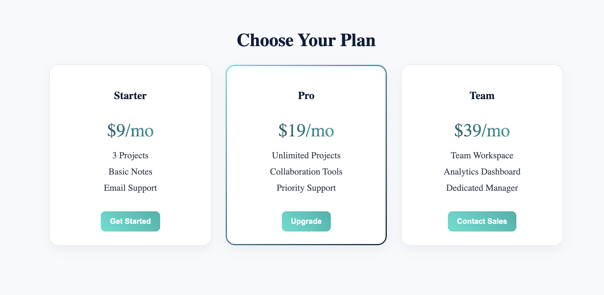

# pricing-table

A modern responsive pricing table built with HTML and CSS, includes gradient effects and hover animations.

## 📝 Description

In this challenge, we built a **modern and responsive pricing table** using **HTML** and **CSS**.  
The design features three pricing plans — Starter, Pro, and Team — each with unique styling, hover animations, and a highlighted **“Most Popular”** plan. The layout adapts perfectly to all screen sizes for a clean and professional look.

---

## 🚀 Features

- **Fully responsive layout** with CSS Grid
- **Elegant gradient text and button effects**
- **Hover animations** for interactive feel
- **Highlighted "Popular" plan** with gradient border
- **Clean, modern, and minimal UI design**

---

## 🔧 Technologies Used

- **HTML5**
- **CSS3 (Grid, Gradients, Transitions, Shadows)**

---

# Demo Page

Click [Here](https://ayshasanyang.github.io/pricing-table/) to view the page

---

## 🚀 How to Run

1. Download or clone the repository

```bash
git clone https://github.com/ayshasanyang/pricing-table.git

```

## 📸 Preview



---

### 🌐 Connect With Me

💻 **YouTube:** [CodeWithAysha](https://www.youtube.com/@CodeWithAysha)  
🎬 **TikTok:** [@codewithaysha](https://www.tiktok.com/@satusanyang)  
📘 **Facebook:** [CodeWithAysha](https://www.facebook.com/share/19vmr6q6cA/?mibextid=wwXIfr)

---

Made with ❤️ by [AYSHA] 🚀
